 

<a href="https://khw-studio.vercel.app"><strong>EXPLORE THE PORTFOLIO ↗</strong></a> &nbsp; · &nbsp; <a href="https://github.com/kahlelhawary-art?tab=repositories"><strong>BROWSE REPOSITORIES ↗</strong></a>

  

<code>AI-ASSISTED DEVELOPMENT</code> &nbsp; <code>MULTILINGUAL INTERFACES</code> &nbsp; <code>WEB · DESKTOP · MOBILE</code>

 

## Built around practical problems

This portfolio brings together business applications, developer tools, and creative web projects built with AI-assisted workflows. The work spans pharmacy management, service-business administration, multilingual interfaces, and AI agent tooling.

The projects below link to source code, published packages, or live demonstrations where available. Private deployments are identified explicitly. Technologies describe the tools used in each project.

 

<table>
<tr>
<td valign="top" width="50%">
<h3>Sore Care</h3>

Client records, scheduling, service documentation, and invoicing for a German care business.

<strong>Built with:</strong> React · Vite · Supabase

No public demo or source link listed.

Project details

Management system a German home-care business runs every day — client records, scheduling, service documentation and invoicing in one place. Private deployment, no public link

</td>
<td valign="top" width="50%">
<h3>KHW Pharmacy — Desktop</h3>

A Windows pharmacy application with point of sale, inventory, reports, and licensing.

<strong>Built with:</strong> Electron · React · TypeScript · SQLite · Tailwind

<a href="https://github.com/kahlelhawary-art/KHW/releases/latest">Download</a>

Project details

Pharmacy management suite for Windows, shipping at v0.1.7 — point of sale, FIFO inventory by expiry batch, reports, bilingual AR/EN, auto-update, and a licensing server

</td>
</tr>
<tr>
<td valign="top" width="100%" colspan="2">
<h3>KHW Pharmacy — Mobile</h3>

An offline Android companion with point of sale, barcode scanning, and thermal printing.

<strong>Built with:</strong> Capacitor · React · TypeScript · Dexie · Tailwind

No public demo or source link listed.

Project details

Offline-first Android companion — the full point of sale runs on-device with no server, plus barcode scanning, thermal printing, and JSON backup

</td>
</tr>
</table>

 

<table>
<tr>
<td valign="top" width="50%">
<h3>rtl-lint</h3>

Find CSS and Tailwind patterns that break right-to-left layouts.

<strong>Built with:</strong> Node.js · CLI

<a href="https://www.npmjs.com/package/rtl-lint">npm</a> · <a href="https://github.com/kahlelhawary-art/rtl-lint">Code</a>

Project details

Published on npm — finds layout that breaks in Arabic and Hebrew: physical CSS properties, directional Tailwind utilities, missing `dir`, each with the logical fix. Zero dependencies, 44 tests

</td>
<td valign="top" width="50%">
<h3>rtl-mcp</h3>

Bring Arabic text and right-to-left interface tools into coding-agent workflows.

<strong>Built with:</strong> Node.js · MCP

<a href="https://www.npmjs.com/package/rtl-mcp">npm</a> · <a href="https://github.com/kahlelhawary-art/rtl-mcp">Code</a>

Project details

Published on npm — an MCP server that gives a coding agent right-to-left awareness: lint code for RTL breakage, normalise Arabic for search keys, detect script direction. Protocol layer written without the reference SDK's 17 dependencies, then verified against its client in CI

</td>
</tr>
<tr>
<td valign="top" width="50%">
<h3>electron-capacitor-starter</h3>

One React foundation for web, Windows, and Android applications.

<strong>Built with:</strong> Electron · Capacitor · React · TypeScript · SQLite

<a href="https://github.com/kahlelhawary-art/electron-capacitor-starter">Code</a>

Project details

Template: one React codebase shipping as a Windows app, an Android app and a web app, joined by a single storage interface — SQLite via `node:sqlite` on the desktop, IndexedDB on the device, one contract suite run against both. CI boots the real Electron app and builds the installer

</td>
<td valign="top" width="50%">
<h3>FlowAgent</h3>

An AI agent orchestration framework with RAG and runtime plugins.

<strong>Built with:</strong> Python · TypeScript · Go

<a href="https://pypi.org/project/flowagent-framework/">PyPI</a> · <a href="https://github.com/kahlelhawary-art/FlowAgent">Code</a>

Project details

Published on PyPI — AI agent orchestration framework with automatic parallelisation of independent steps, a built-in RAG engine, and a runtime plugin system

</td>
</tr>
</table>

 

<table>
<tr>
<td valign="top" width="50%">
<h3>PhD Match DE</h3>

Match candidate profiles to German life-science PhD positions.

<strong>Built with:</strong> React · Supabase · Tailwind · PDF.js

<a href="https://phd-match-de.vercel.app">Live</a> · <a href="https://github.com/kahlelhawary-art/phd-match-de">Code</a>

Project details

Matches candidates to open PhD positions in German life-sciences programs — AI matching, PDF parsing, trilingual DE/EN/AR

</td>
<td valign="top" width="50%">
<h3>TaskFlow</h3>

Task management with authentication, boards, and real-time updates.

<strong>Built with:</strong> React · FastAPI · PostgreSQL

<a href="https://taskflow-frontend-ezbw.onrender.com">Live</a> · <a href="https://github.com/kahlelhawary-art/TaskFlow">Code</a>

Project details

Full-stack task management app with auth, boards, and real-time updates

</td>
</tr>
<tr>
<td valign="top" width="50%">
<h3>CareerAgent</h3>

An AI-assisted workflow for job discovery and application preparation.

<strong>Built with:</strong> FastAPI · SQLModel · OpenAI · React · TypeScript

No public demo or source link listed.

Project details

Autonomous job-application system — scrapes StepStone and Indeed Germany, tailors CV and cover letter with AI, then applies by email

</td>
<td valign="top" width="50%">
<h3>Nuqoosh</h3>

Personalized, multilingual poem pages with cinematic typography.

<strong>Built with:</strong> JavaScript · Canvas · HTML5

<a href="https://nuqoosh.vercel.app">Live</a> · <a href="https://github.com/kahlelhawary-art/nuqoosh">Code</a>

Project details

Cinematic personalized poem pages as a keepsake gift — trilingual AR/EN/DE with scroll-reveal typography

</td>
</tr>
<tr>
<td valign="top" width="100%" colspan="2">
<h3>King Barber</h3>

A responsive barbershop website and gallery.

<strong>Built with:</strong> React · Tailwind

<a href="https://king-barbier.vercel.app">Live</a>

Project details

Barbershop website with booking flow and gallery

</td>
</tr>
</table>

 

<table>
<tr>
<td valign="top" width="100%" colspan="2">
<h3>Offline Developer Playbook</h3>

A practical guide to working with development tools without internet access.

<strong>Built with:</strong> PowerShell · Bash · Docs

<a href="https://github.com/kahlelhawary-art/offline-developer-playbook">Code</a>

Project details

Staying productive as a developer with no internet at all — local code models, offline docs, pre-cached npm/PyPI/Docker, cloud-free backups. 1,400 lines across seven chapters, written twice in English and Arabic, with setup, verify, backup and drill scripts for Windows, macOS and Linux

</td>
</tr>
</table>

<strong>Explore the technology stack</strong>

Technologies used across these projects:

| Area | Technologies |
| --- | --- |
| Web interfaces | React, TypeScript, JavaScript, Tailwind CSS, Vite |
| Visual experiences | Three.js, Framer Motion, GSAP, Canvas |
| Backend and AI | Python, Node.js, FastAPI, Express, LLM integrations, MCP |
| Desktop and mobile | Electron, Capacitor, Android |
| Data and deployment | PostgreSQL, SQLite, Supabase, IndexedDB, Firebase, Docker, Vercel |

 

---

**KHW STUDIO**

Business applications · Arabic interfaces · AI tools

[Visit the portfolio ↗](https://khw-studio.vercel.app) · [Explore all repositories ↗](https://github.com/kahlelhawary-art?tab=repositories)

